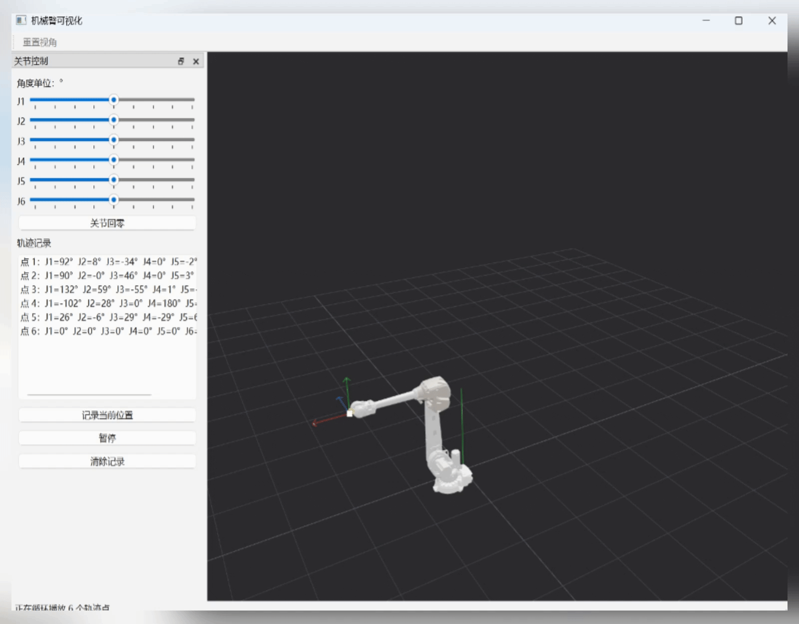

# Qt OpenGL 机械臂可视化

基于 Qt 6、OpenGL 3.3 和 tinygltf v3 的 ABB IRB4600 机械臂可视化示例。项目直接加载根目录中的 `irb4600.glb`，保留 GLB 的多网格、多材质信息，并提供关节控制、末端位置拖动和轨迹播放。



## 已实现功能

- **GLB 模型加载**：使用 tinygltf v3 读取 GLB；同一组件内的多个 primitive 分别渲染，支持 ABB 标识等多材质颜色。
- **简单 PBR 光照**：基色、金属度、粗糙度、环境补光与色调映射，适合查看金属机械臂模型。
- **六轴关节控制**：左侧 J1–J6 滑块可实时调整模型姿态。
- **相机操作**：左键平移，中键围绕观察目标旋转，滚轮缩放。
- **组件选择**：点击模型组件后高亮选择，并显示其局部坐标 Gizmo。
- **末端目标拖动与 IK**：选中 `link6` 后可拖动 Gizmo 设定末端目标；红、绿、蓝轴用于单轴拖动，轴心白点用于相机平面内的自由拖动。IK 以阻尼最小二乘法求解关节角度。
- **轨迹记录与循环播放**：记录多个关节姿态点；播放采用五次缓入缓出插值，每段结束后平滑回到第一点并持续循环。播放期间按钮可暂停/继续。

## 构建环境

- Qt 6.5 或更高版本（当前使用 Qt 6.7.2）
- 支持 C++17 的编译器
- CMake 3.19 或更高版本
- OpenGL 3.3 Core Profile

## 构建与运行

```powershell
cmake -S . -B build
cmake --build build --config Debug
.\build\Debug\robot.exe
```

若使用单配置生成器，程序通常位于 `build/robot.exe`。构建后会自动将根目录的 `irb4600.glb` 复制到可执行文件目录；程序也会优先从当前工作目录读取该模型。

## 使用说明

1. 启动程序后，通过左侧 J1–J6 滑块调整姿态。
2. 点击 `link6`（末端组件）显示目标 Gizmo。
3. 拖动彩色轴可沿该轴移动 TCP；拖动轴心白色区域可在当前屏幕平面自由移动 TCP。
4. 每次位置目标移动均会自动调用 IK，模型和 Gizmo 会同步更新。
5. 调好姿态后点击“记录当前位置”，至少保存两个点。
6. 点击“开始播放”进行循环播放；播放时按钮变为“暂停”。“清除记录”可删除全部轨迹点。

手动拖动关节滑块、移动 Gizmo 或执行新的 IK 目标时，正在播放的轨迹会停止，避免控制来源互相覆盖。

## 代码结构

```text
render/
  orbitcamera.*          相机平移、环绕和缩放
  robotopenglwidget.*    OpenGL 渲染、拾取和交互入口
  scenepicker.*          GLB 节点射线拾取
  targetgizmo.*          三轴与中心平面位置拖动 Gizmo
robot/
  glbmodel.*             GLB 场景/网格/材质数据
  tinygltfloader.*       tinygltf v3 到项目数据的转换
  robotmodel.*           关节状态与节点正向变换
  iksolver.*             阻尼最小二乘位置 IK
  trajectoryplayer.*     记录点插值、暂停和循环播放
  joint.* / link.*       关节、连接件基础类型
tinygltf/                项目所需的 tinygltf v3 源文件
img/img.gif              项目演示动图
```

## 模型约定

当前 IRB4600 模型的可动节点命名为 `link1` 到 `link6`。`RobotModel` 根据此命名将 J1–J6 的关节角度应用在对应节点的局部坐标系中。模型文件以毫米导出时，加载路径会统一转换至视图使用的米制单位。
